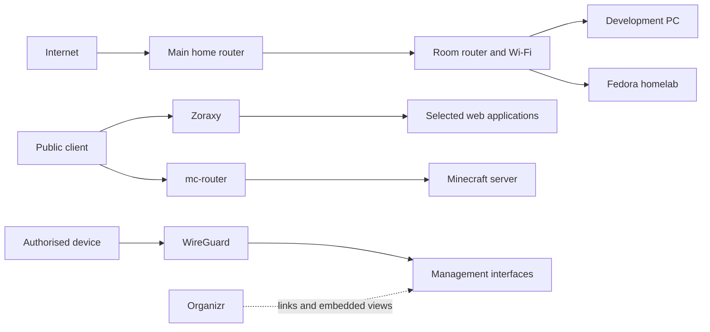

# Architecture and security boundaries

My room has its own router because the Wi-Fi from the main router was not good
enough for PCVR and everyday mobile use. The development PC and homelab are
connected to it by cable, which also makes large local transfers independent of
the public internet. The router uses its own routed network rather than acting
only as an access point. That adds another layer of NAT, but it solved the
practical problem I bought it for.

I leave exact addresses, forwarding rules and device identifiers out of this
repository.

## Access paths

Zoraxy is the common entry point for web applications and handles their
certificates. Minecraft uses its own protocol and enters through `mc-router`.
Komodo, the server desktop and the other management interfaces are intended to
stay on the local or VPN path. Organizr is a start page rather than a security
gateway; the browser still needs a valid route to each embedded service.

The active services run with rootful Podman and Compose-compatible definitions.
That keeps the current setup straightforward, but it also means I have to pay
attention to mounts and any component that can control the container engine.

## Risks I actually worry about

- A router or proxy change could expose a management interface. Public routes
  are configured only for selected services, but I have not yet verified the
  complete surface from an external network.
- The live Minecraft auto-start mechanism has broader Podman access than I am
  comfortable with. I left it out of the public example, but that does not
  solve the permission problem on the live system.
- A vulnerable public application could reach more data or services than it
  needs. Network separation and privileges currently differ between stacks and
  still need a deliberate review.
- Gitleaks catches common secret patterns, not every private value. The public
  examples are therefore rebuilt with placeholders and manually reviewed.

For now I prefer a few checks tied to the real system over a long generic threat
list. The next useful security evidence is a dated comparison between the
routes I intend to expose and what an outside client can actually reach. Live
addresses, complete scan output and raw logs will stay private.

The four questions in the
[OWASP Threat Modeling Cheat Sheet](https://cheatsheetseries.owasp.org/cheatsheets/Threat_Modeling_Cheat_Sheet.html)
helped me structure this review around the system, realistic failures, changes
and checks.
