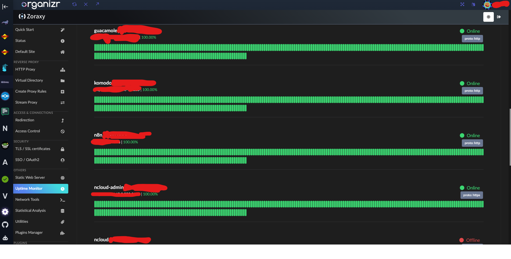

# Operations, backups and recovery

I use Borg through Vorta to back up the parts of the Fedora host that would be
difficult or time-consuming to rebuild. The job runs every hour while my Fedora
user session and Vorta are running. It includes my home directory plus selected
service and host-configuration directories; the Borg repository itself is
excluded from those source paths.

## Backup setup

- Borg encrypts the repository and uses Zstandard compression at level 8.
- The primary repository is stored on the homelab's NVMe SSD.
- Additional encrypted copies are kept on my development PC and in off-device
  cloud storage.
- Vorta keeps 36 hourly, 30 daily, 12 weekly and 24 monthly archives. The prune
  rule keeps annual archives without a fixed limit and preserves every archive
  from the last ten hours.

The local repository is convenient for deleted files and other logical
mistakes, but it is on the same physical SSD as the live data. The other copies
are meant for drive or host failure. I have not yet proved that by restoring
directly from one of them, and I still need to verify that the copying method
always leaves a consistent Borg repository.

## Restore test

I restored a small `test.txt` file through Vorta into my Downloads folder. The
file opened correctly. The GUI is less convenient than restoring a version
through Git, but it was still straightforward and usable.

So far I have only restored that one file, not a complete service. The next
meaningful test is opening an off-device repository copy and restoring one
stateful service into a separate directory before touching live data. That test
also needs the Borg key and passphrase to be recoverable without the homelab.

## How I operate it today

Monitoring is still mostly manual. I use systemd and Podman logs for host and
container problems, Zoraxy logs for the public web path and Vorta results for
backup jobs. Organizr and Zoraxy show basic availability checks, but there is no
external notification path. If the whole host is down, its own dashboard cannot
warn me.

*The Zoraxy uptime view I open through Organizr. Target addresses and account
details are redacted. These same-host checks are useful for a quick overview,
but they are not an external alerting system.*

When something breaks, I normally check the latest logs, recent image or package
changes, container health and available disk space. For a failed backup I check
the Vorta result, Borg log and repository space first. I do not publish raw logs
because they can contain account names, paths and live service details.

The next two operational checks that would add real evidence are:

1. restore a complete service from an off-device Borg copy and record the
   result and duration;
2. verify what starts again after a host reboot without relying on memory or an
   already open desktop session.
