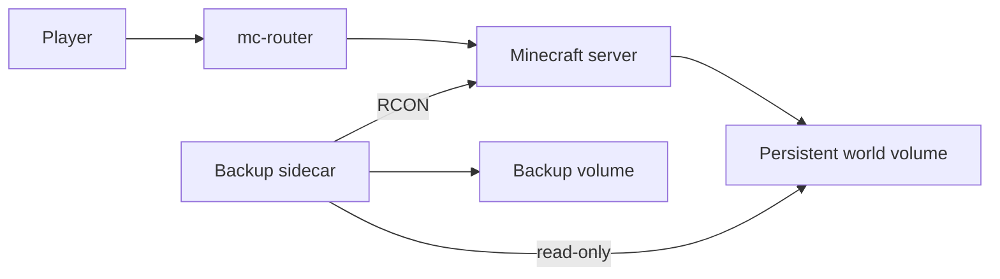

# Minecraft routing and coordinated backups

I wanted my modded server to stop when nobody was playing but still start when
the next player connected. That turned a hobby server into a routing, state and
backup problem.

The live stack uses `mc-router` to start the server on the first connection and
stop it after an idle period. That has worked reliably in regular use, but the
current mechanism needs broader Podman access than I am comfortable presenting
as a reusable design. The reduced example therefore keeps static routing and
leaves the automatic lifecycle out.

Only the router publishes a host port. The Minecraft container keeps the game
data, while the backup sidecar mounts that volume read-only and uses RCON to
coordinate writes before creating an archive. The password comes from a local
file mounted as a Compose secret instead of an environment value.

## Trying the reduced example

1. Copy `rcon-password.example` to `rcon-password.txt` and replace its content.
2. Add `127.0.0.1 play.example.invalid` to the hosts file on the test machine.
3. Review the pinned images, Minecraft version and memory values.
4. Run `docker compose up -d` or the equivalent command for the Compose
   frontend being tested.
5. Connect to `play.example.invalid`, then inspect the server health and backup
   output.

The host port is bound to loopback, so the example is not exposed to the local
network by default. The 4 GB setting controls the Java heap; the Compose file
also places a 5 GB memory limit on the container. Named volumes avoid publishing
private host paths and keep the server data separate from the backup archives.

I parsed this file with Docker Compose 5.1.2 on 2026-08-14. I have not yet run
this reduced version separately on Fedora with Podman, so I do not claim that
its bind, secret and health-check behaviour has been verified there.

The image digests and Minecraft version are fixed so that a later restart does
not silently change the example. They still need deliberate updates when I want
security fixes or a newer game version.

## What is still missing

- a complete world restore into a separate volume followed by a successful
  server start;
- a restricted replacement for the live lifecycle component's broad Podman
  access;
- a test of the router while a backend is still starting.

Upstream projects: [mc-router](https://github.com/itzg/mc-router),
[docker-minecraft-server](https://github.com/itzg/docker-minecraft-server) and
[docker-mc-backup](https://github.com/itzg/docker-mc-backup).
