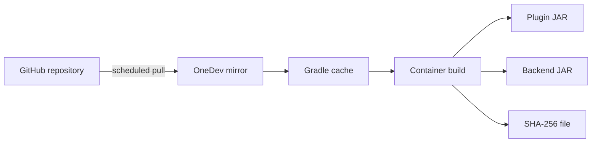

# OneDev artifact packaging

I mainly use OneDev as a local fallback for builds and artifacts while GitHub
remains the public source repository. The job mirrors selected branches, builds
a multi-module Gradle project in a container and keeps separate plugin and
backend JAR files.

The example uses a cache key derived from the Gradle wrapper properties and a
separate Gradle user home. I only mirror branches I control; this job would not
be safe for arbitrary pull-request code. The public mirror shown in the example
does not need a token. A private repository should use a read-only credential
limited to that repository.

The Gradle image is pinned to the digest I resolved on 2026-08-14. The build
also writes SHA-256 checksums for the two JAR artifacts. This makes changes more
deliberate, but the image still needs a conscious update process.

## Honest limitation

The job currently runs `build -x test`. A green run tells me that both modules
compiled and packaged; it does not tell me that the code passed tests. Until I
add a small reliable test set and remove the exclusion, I call this artifact
packaging rather than a test-verified CI pipeline.

The source is in [buildspec.yml](buildspec.yml). It uses OneDev build-spec
schema version 46 and placeholders for the repository, project and schedule.
OneDev may rewrite the exported structure between versions, so the result still
needs reviewing after import.

I have not added automatic deployment yet. My Paper test server currently
starts from IntelliJ; I first want simple restart, health-check and rollback
scripts that work locally without OneDev.
